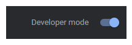
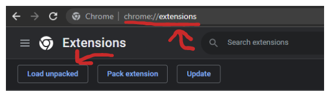

# 🚀Awesome Prompts & ChatGPT Prompt Generator

This enhanced extension is designed to further simplify access to ChatGPT by adapting the two repositories' awesome prompt list and prompt generator interfaces trained with that list.
**It is an unofficial project for personal learning purposes only.**

| Github Repo                                                                                                                | Huggingface Space                                                                                                                             | Chrome Extension                                                                                                         |
| -------------------------------------------------------------------------------------------------------------------------- | --------------------------------------------------------------------------------------------------------------------------------------------- | ------------------------------------------------------------------------------------------------------------------------ |
|  |  |  |

# 📦 Install

First install the project dependencies and get the build

`npm install --force` and `npm run build`

And activate the developer mode and then select the `dist` file from load unpacked

# 🗒️ Todo

- [ ] Awesome prompt categorization
- [ ] Mobile responsive improvements

# 🧠 Awesome Promtps

# 👨🏻‍🎤 Generate ChatGPT prompt

